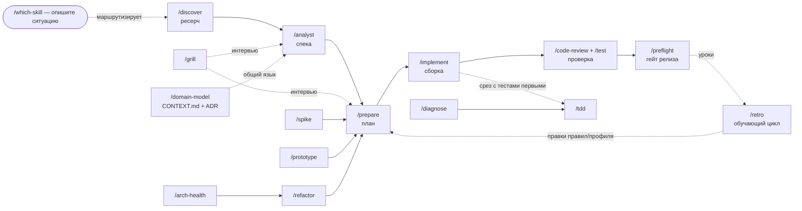

[English](README.md) · **Русский**


# FourEyes 🤓

> Самодостаточный `.claude/`, который превращает любой репозиторий в дисциплинированную фабрику
> фич — один адаптивный конвейер от discovery до отгруженного кода, за которым стоит флот
> субагентов, возвращающих сигнал, а не шум.

*Оба смысла заложены намеренно. **Four-eyes** — это тот самый очкарик, который и правда прочитал
инструкцию. **Принцип четырёх глаз** (four-eyes principle) — правило, по которому ни одна значимая
работа не принимается на одной паре глаз. Кит автоматизирует второе, чтобы вы могли позволить себе
быть первым.*

Портируемый, **адаптирующийся к стеку** конвейер фич (`/discover → /analyst → /prepare →
/implement`) плюс навыки качества, согласования и бэклога, 16 субагентов, generic- и stack-паки
правил, хуки и адаптер `/bootstrap`, который подгоняет всё это под любой проект. Положите кит в
`.claude/` проекта, запустите `/bootstrap` — и получите полный workflow плюс правила под конкретный
проект, без переписывания навыков под каждый репозиторий.

## Что было измерено — включая результаты, которые говорят против кита

Большинство китов отгружает заявления. Этот сначала прогнали через слепой A/B-стенд: два арма
одного и того же реального репозитория, отличающиеся ровно одним; запечатанная карта
перемешивания; рубрика по 5 осям (корректность · edge/unhappy-path · верификация · честность
отчёта · соответствие процессу) и написанный заранее раздел про пределы шума. Четыре раунда. Ниже
всё, что стенд вернул, включая негативные результаты.

| Вопрос, заданный стенду | Что вернулось |
|---|---|
| Дают ли generic-правила выигрыш против полного отсутствия правил? | **Да, слабо.** Раунд 1, 16 прогонов: арм *с* правилами выигрывает в 2 типах задач из 4, ничья в 2, поражений 0 — среднее Δ ≈ +0.5 по рубрике, чище всего на имплементации и планировании. При этом он сжёг **в 1.3–2× больше токенов.** |
| Делает ли always-on-тир правил вывод *лучше*? | **Нет — три раунда подряд, измеримого прироста качества нет.** Он стабильно *дешевле* (0.82× и 0.93× токенов на двух слотах). Честная формулировка — *«тот же результат за меньшие деньги»*, а не *«работает лучше»*. Именно из-за этого результата always-on-тир урезали с 13 правил до 4. |
| Срабатывают ли навыки сами, когда промпт им подходит? | **Нет. Ноль вызовов на всех 16 прогонах.** ~10k токенов always-on-описаний навыков не совпали ни с чем. Это и есть находка, из которой выросли [ручной режим по умолчанию и три обходных пути](#manual-skills). |
| Окупает ли *конкретное* правило свой контекст? | **Стенд не может на это ответить** — изолировать одно правило и сохранить прогон валидным оказалось взаимоисключающими условиями. Сказать это было полезнее, чем выдать число; очередь кандидатов закрыли счётчиками по транскриптам. |

**Пределы, прямым текстом.** Один продакшен-репозиторий на Python плюс нейтральные армы, n=2 на
ячейку, и судья — модель. Stack-паки (ruby / rails / react-ts / postgres) вообще не участвовали ни в
одном арме — это контрибьюченные шаблоны, а не измеренные. Читайте таблицу как направление, а не как
бенчмарк.

Публиковать негативные результаты имеет смысл потому, что именно они дорогие. Написать файл с
правилами может кто угодно; понять, что целый их тир покупает стоимость, а не качество, стоило
четырёх раундов и ~40 отсуженных сессий — и изменило форму кита.

### Слой дисциплины — то, чего вы не найдёте в другом ките

Большинство китов даёт вам *workflow*. Форма конвейера (`discover → ship`, интервью по одному
вопросу, живые глоссарии) реальна, но не уникальна — это общая методология, и FourEyes
[отдаёт должное своей родословной](#why-foureyes). Отличает FourEyes **слой дисциплины под
workflow**: явная модель того, *как агенты ломаются*, и контрмеры, вшитые в структуру, а не в
надежду. Если брать отсюда что-то одно — берите это.

- **Полевой каталог из 22 режимов отказа агентов** — [`docs/agent-failure-modes.md`](docs/agent-failure-modes.md).
  Каждая запись — это *симптом → механизм (почему так происходит) → контрмера → где кит уже её
  вшил*. `/retro` классифицирует повторяющиеся проблемы по этому каталогу; `/writing-skills`
  проектирует новые навыки *против* него. Большинство китов отгружает «best practices»; этот
  отгружает теорию дефектов и лечение для каждого.
- **Правила «изнутри генерации»** — [`docs/self-knowledge.md`](docs/self-knowledge.md) плюс
  дистиллированные правила [`self-knowledge`](rules/_generic/core.md),
  [`diligence`](rules/_generic/core.md) и [`decision-craft`](rules/_generic/core.md). Они бьют по
  тем дефолтам, которые сильная модель *не* исправит сама: вспомненные факты по умолчанию
  устаревшие (сверяйтесь с lockfile, а не с памятью); доказательства выводятся до вердикта
  (написанный первым вердикт заякоривает анализ под себя); нельзя честно ревьюить то, что только
  что написал (настоящий review уходит в свежий контекст); переписывания регрессируют к среднему по
  обучению (удивляющий код считается несущим, пока не доказано обратное); усилие — это
  *распределение, а не мотивация* (done — это внешний список, сложное идёт первым, домашку не
  возвращают обратно). Это поведенческий override, а не подбадривание.
- **Greppability как архитектурный контракт** — [`rules/_generic/code.md`](rules/_generic/code.md).
  Посылка: *следующий сопровождающий — это агент, который навигирует поиском по точному имени*,
  поэтому любая будущая инвентаризация (`/sweep`, доказательство мёртвого кода, аудит) полна ровно
  настолько, насколько её видит поиск. Один символ = одно greppable-место определения; никаких имён,
  собираемых в рантайме, вне объявленного перечислимого шва. Boilerplate — не оправдание:
  человеческий мотив метапрограммирования (усталость от печати) к агенту не применим, а издержки
  бьют по агентам сильнее.
- **Состязательная верификация с разными линзами** — **Finding Contract** по всему флоту плюс
  **panel mode** у `finding-verifier`: N клонов с одинаковым брифом делят слепые зоны (их согласие —
  это эхо), поэтому CRITICAL-находки получают по одной *отдельной линзе* на инстанс (корректность /
  безопасность / воспроизводится ли), default-REFUTED и голосование большинством. Независимость
  покупается формулировкой, а не количеством голов.

Workflow — это та часть, которую вы узнаете по другим китам. Слой дисциплины — та часть, из-за
которой review на 10 агентов возвращает сигнал, а не уверенный шум.

<a id="why-foureyes"></a>

### Почему FourEyes, а не очередная коллекция агентов

Большинство репозиториев под Claude Code — это *каталоги*: куча независимых агентов, которые вы
связываете сами. FourEyes — противоположность: **один мнение-имеющий путь с гейтами качества**,
спроектированный так, чтобы оставаться generic.

- **Конвейер, а не куча.** `discover → spec → plan → build → review` как единый самодвижущийся
  поток, а не 200 агентов à la carte.
- **Субагенты, уважающие ваше контекстное окно.** Каждый finder соблюдает единый **Finding
  Contract** — ограниченные структурированные находки (`path:line` + severity + effort + конкретный
  вред) — поэтому review на 10 агентов возвращает сигнал, а не дамп на 8k токенов. Эта дисциплина,
  применённая ко всему флоту, — та часть, которой больше нигде нет.
- **Drop-in и адаптация к стеку.** `/bootstrap` вычитывает ваш репозиторий в `PROJECT.md`; навыки
  остаются generic и подстраиваются в рантайме. Портирование = копия + bootstrap, никогда не правка
  навыков. Дизайн стеко-нейтрален по построению — ни один навык не называет язык — но *обкатан* он
  на Python; паки ruby / rails / react-ts / postgres отгружены без проверки стендом.
- **Переживает долгую работу.** План — единственный источник истины через компакцию и сессии
  (*Artifact-Continuity Contract*): возобновляйтесь посреди фичи без повторных объяснений. Stage
  gates делают конвейер механическим: каждая стадия проверяет предыдущий артефакт на входе и
  возвращает слабый с причинами, вместо того чтобы молча компенсировать ниже по потоку.
- **Обучающийся цикл, а не статичный пак.** Каждый `/implement` пишет Deviation Report; `/retro`
  добывает из них (плюс из handoff'ов и логов diagnose) повторяющиеся, подтверждённые
  доказательствами паттерны и вплавляет уроки обратно в ваши правила и профиль — кит адаптируется к
  вашему проекту со временем.

**Родословная — честно об истоках.** FourEyes стоит на идеях, популяризованных
[навыками Matt Pocock](https://github.com/mattpocock/skills) и
[obra/superpowers](https://github.com/obra/superpowers) (неотступное интервью по одному вопросу,
живой ubiquitous language + ADR, дизайн глубоких модулей, методология discover→ship — с поклоном в
сторону DDD Эрика Эванса и *A Philosophy of Software Design* Джона Оустерхаута). FourEyes добавляет
**дисциплинированный мульти-агентный слой** (Finding Contract) и **портируемую, адаптирующуюся к
стеку дистрибуцию** (`PROJECT.md` + `/bootstrap` + stack-паки правил), чтобы вся методология
ложилась в любой репозиторий и оставалась generic.

Заимствован *метод*, а не текст — ни один файл здесь не является копией их файлов, и навыки двух
китов различаются структурой, фазами и форматом вывода. Оба апстрима под MIT, как и FourEyes
([LICENSE](LICENSE)); упоминание выше — долг идеям независимо от того, чего требует лицензия.

### FourEyes против двух распространённых архетипов

| | **Каталоги** (wshobson, VoltAgent) | **Методологии** (superpowers, mattpocock) | **FourEyes** |
|---|---|---|---|
| Форма | агенты à la carte, которые вы связываете сами | поток навыков с мнением | поток с мнением **+ портируемая дистрибуция** |
| Адаптация к вашему репозиторию | вручную | через корневой документ | `/bootstrap` → `PROJECT.md`, навыки остаются generic |
| Контроль мульти-агентного шума | по агенту, ad hoc | лёгкий | единый **Finding Contract** на весь флот |
| Always-on-правила | редко | редко | generic- и stack-паки правил со `paths:`-скоупом |
| Выживание контекста | — | файлы плана/handoff | Artifact-Continuity Contract (план = SSOT) |

## Установка

FourEyes ставится **копированием внутрь**: файлы живут в `.claude/` вашего проекта (именно это
оставляет команды без префикса, а правила — always-on;
[плагины не умеют ни того, ни другого](#distribution-model)).

**Скопируйте кит, затем адаптируйте.** Замените `<project>` на путь к вашему проекту и запускайте
откуда угодно, **кроме** самого проекта: клон — временные леса, а не то, что вы оставляете себе.

```bash
# 1. Склонируйте кит во временное место — НЕ внутрь проекта
git clone https://github.com/mik2win/foureyes.git /tmp/foureyes

# 2. Забэкапьте всё, что кит и /bootstrap могут перезаписать
[ -e <project>/.claude ]   && cp -r <project>/.claude <project>/.claude.bak
[ -f <project>/CLAUDE.md ] && cp <project>/CLAUDE.md <project>/CLAUDE.md.bak

# 3. Скопируйте кит в .claude/ проекта (инфраструктура репозитория остаётся снаружи)
rsync -a --exclude='.git' --exclude='.claude' --exclude='_backlog' --exclude='tools' \
  --exclude='.github' --exclude='LICENSE' --exclude='CONTRIBUTING.md' --exclude='CHANGELOG.md' \
  --exclude='CODE_OF_CONDUCT.md' --exclude='SECURITY.md' --exclude='.gitignore' \
  /tmp/foureyes/ <project>/.claude/

# 4. Удалите клон — кит теперь живёт в вашем проекте
rm -rf /tmp/foureyes
```

Затем откройте проект в Claude Code и запустите **`/bootstrap`**. Полный разбор:
[Интеграция в новый проект](#integrate).

Две вещи, которые стоит знать заранее: существующий `.claude/settings.local.json` **уцелеет**
(копирование добавляет файлы, ваши оно не удаляет), а если под ваш стек пака правил в библиотеке
нет — `/bootstrap` скажет об этом и предложит продолжить только с generic-правилами, он не
угадывает.

Копирование внутрь — **единственный** путь установки, и это осознанно: почему плагин не может
нести этот кит, см. [Модель распространения](#distribution-model).

## Что внутри

| Часть | Что это |
|------|------|
| **Навыки конвейера** | `/discover` → `/analyst` → `/prepare` → `/implement` (research → spec → plan → code — `/implement` направляет каждую встреченную находку по одной из четырёх веток: починить, завести карточку, STOP и спросить, или передать соседу, который владеет файлом) · `/idea` — вход на простом языке над всем хребтом: нетехнический пользователь описывает результат, агент вытягивает желание в сценариях-результатах, показывает 2–3 формы решения с ощутимыми trade-off'ами, а затем сам ведёт конвейер, забирая на себя каждое техническое решение (контракт регистра: `docs/audience-altitude.md`) · `/scaffold` — короткая ветка от хребта для «добавь ещё один такой же»: сначала прочитать канонический образец, разместить по профилю, затем подключить каждую точку регистрации и **доказать каждую командой** (настоящий отказ в этой задаче молчаливый — невыполненный несущий импорт ничего не бросает, артефакт просто отсутствует в `--help`) |
| **Ориентация** | `/onboard` — быстрое понимание незнакомой/унаследованной кодовой базы: сначала запустить (поведение якорит чтение), один поток прослежен от начала до конца (диалект архитектуры), археология git-истории (горячие точки churn = где живёт бизнес, bus factor, тот самый страшный старый код), тесты как документация, список несущих странностей (удивляющий код никогда не нормализуется при первом контакте) → письменная карта ориентации, которая питает `/bootstrap` |
| **Сначала исследование** | `/spike` (проверить ОДНУ рискованную гипотезу, с таймбоксом, на выброс) · `/prototype` (исследовать пространство дизайна — запускаемая логика или несколько UI-вариантов) · `/select-tech` (выбрать библиотеку/gem/фреймворк/сервис или решить писать самим: жёсткие фильтры отсекают быстро, затем состязательное погружение в 2–3 финалиста — issue tracker важнее README, проба на сложном кейсе по настоящей документации вместо туториального кейса, история upgrade-путей как ваш будущий налог, bus factor, стоимость побега — матрица с оценками и ОДНОЙ рекомендацией, нулевой вариант «напишем сами» всегда в бюллетене, и интеграционный контракт через adapter-шов, чтобы выбор остался дверью в обе стороны; все факты о кандидатах проверяются вживую, никогда по памяти) |
| **Согласование и дизайн** | `/grill` (примитив неотступного интервью по одному вопросу, переиспользуемый конвейером) · `/grill-with-docs` (grill + фиксация терминов/ADR по ходу) · `/domain-model` (живой глоссарий `CONTEXT.md` + ADR — общий язык проекта) · `/codebase-design` (словарь дизайна глубоких модулей) · `/api-design` (публичные контракты — endpoint/webhook/CLI/библиотека: сначала потребители и обещание совместимости, модель ресурсов на языке домена, чеклист контракта — один конверт ошибки, курсорная пагинация на каждом списке с первого дня, ключи идемпотентности для повторяемых не-GET, эволюция только добавлением — разобранные примеры включая ошибочные кейсы, и проход «глазами потребителя», который пишет клиентский код для сложного случая до отгрузки контракта; закон Хайрама воспринят всерьёз: каждое выставленное поле — навсегда) |
| **Навыки качества** | `/code-review` (CRITICAL-находки проходят состязательный гейт `finding-verifier` до того, как вы их увидите), `/refactor`, `/diagnose`, `/test`, `/tdd` (red-green-refactor, тесты первыми), `/test-spec` (сначала спека — вывести тесты из плана, *не читая код*; спека и есть истина), `/arch-health` (периодическое сканирование на ball of mud + проверка дрейфа PROJECT.md) · `/clean-mvp` (зачистка мусора по всей кодовой базе — мёртвый код, неиспользуемые файлы, легаси-прокладки, с гейтом доказательства мёртвости) · `/sweep` (массовая механическая миграция: полная инвентаризация мест → пилотный батч → проверенные батчи → повторное сканирование до нуля остатков; примерно с 30+ механических мест пишется инструмент, а не правки — AST-codemod, обкатанный на пилоте и сохранённый как повторно запускаемый артефакт, потому что ручная правка длинного хвоста — это накапливающаяся поверхность ошибок) · `/perf` (оптимизация от измерения: названная метрика и бюджет до того, как прочитан хоть один код, воспроизводимый baseline, цель выбирает профайлер — никогда не интуиция, порядок по величине рычага (не делать работу > батчить > правильный алгоритм > микро), одно изменение на один повторный замер с ожидаемым-против-фактического, кэши объявляются с инвалидацией и потолком, останов на бюджете — переоптимизация это работа с отрицательной ценностью) |
| **Эволюция архитектуры** | `/decompose` (монолит vs модульный монолит vs выделение сервиса, решается по каждой границе на доказательствах — реальные драйверы (конкуренция за деплой, асимметричное масштабирование, изоляция отказов, владение командой — организационные факты *спрашиваются*, а не выводятся из кода) взвешиваются против явно принятого налога на распределённость; вердикт STAY / MODULARIZE / EXTRACT с управляющим правилом «сначала выдели шов, потом сервис», STAY фиксируется как полноценный ADR, чтобы его не переоткрывали; EXTRACT исполняется через strangler-стадии `/rollout`) · `/revisit` (решения гниют молча — переаудит прошлых выборов (ADR, решения `/select-tech`, недокументированные несущие выборы через археологию git) через извлечение фальсифицируемых допущений каждого решения и проверку их против сегодняшнего дня: внутренние свидетельства из репозитория, внешние проверяются вживую (никогда по памяти), организационные изменения спрашиваются; вердикт HOLDS / STRAINED (ставится измеримый tripwire) / BROKEN (переоткрывается только по названному сломанному допущению с доказательством — это аудит допущений, а не предпочтений); ADR замещаются, а не переписываются) · `/distill` (добыть неявные конвенции репозитория по десяти измерениям, с ≥3 процитированными вхождениями на каждое; вердикт BLESS / UNIFY (налог на форк — победитель выбирается вместе с пользователем, места проигравшего → `/sweep`) / BAN (замена всегда названа) / DEEPEN (семейство copy-paste → глубокий модуль); гейт намерения до любого запрета — странное-но-консистентное лучше знакомого-но-чужого; вердикты устанавливаются на нужной высоте: тонкие always-on-правила с GOOD/BAD-образцами из самого репозитория, тяжёлый справочник по требованию, термины → `CONTEXT.md`) — триада «посмотреть на построенное»: структура (`/decompose`), решения (`/revisit`), конвенции (`/distill`) |
| **Отгрузка и обучение** | `/rollout` (поэтапная стратегия для рискованных/необратимых изменений — expand-contract, strangler fig, флаги/canary, версионное сосуществование; каждая стадия деплоится, проверяется и откатывается по отдельности; разрушающий шаг последний, с гейтом на наблюдаемой нулевой зависимости) · `/preflight` (гейт готовности к релизу: полный прогон тестов, быстрый проход по зависимостям/безопасности, дрейф документации, проверка конфигов/миграций, черновик changelog, вердикт GO/NO-GO — деплой предлагается, никогда не запускается) · `/incident` (дисциплина продакшен-пожара — живая инверсия `/diagnose`: триаж → сохранить свидетельства *до* того, как митигация их уничтожит → митигировать в сторону известно-рабочего (откат/выключение флага, никакого нового кода на адреналине) → подтвердить восстановление по видимому пользователю сигналу → безвинный разбор; команды предлагаются, никогда не запускаются) · `/retro` (обучающий цикл: добыть из Deviation Reports, handoff'ов и логов diagnose повторяющиеся проверенные паттерны и вплавить каждый урок обратно в правила/PROJECT.md/навыки с подтверждением) |
| **Бэклог (локальный трекер)** | `/to-prd` (разговор → PRD) · `/to-issues` (план → issues вертикальными срезами) · `/triage` (двигать issues по машине состояний) · `/epic-status` (read-only дашборд прогресса по декомпозиции, разбитой на волны: следующая безопасная волна, проверка коллизий сессий и `RUN-ORDER` эпика, сверенный с собственным frontmatter планов — пометка `∥` это *заявление*, оно перепроверяется против множеств `Owns`, а расхождение между ними докладывается, а не сверяется молча) · `/close-epic` (терминальный собрат — сначала все планы в терминальном состоянии, затем **end-to-end батарея**: объявленный в эпике блок `## E2E verify`, если он есть, иначе батарея, *выведенная* из поверхностей, которых коснулся диф, и раскрытая как выведенная; прогоны делегируются, а вердикт нет, и одно заглавное число всегда перевыводится вручную; затем соответствие план↔код и дрейф документации, completeness-критик, **промоушен каждого помеченного follow-up в нумерованную карточку** (`F<wave>.<n>`, с указанием куда идёт и почему), строка реестра предсказанное-против-фактического, `## E2E results`, записанные обратно в overview эпика, и команда архивирования для копипаста, которую он никогда не выполняет) — всё в локальном markdown, без внешнего трекера |
| **Сессия / контекст** | `/handoff` — снимок живого состояния (сделано · дальше · решения · файлы · как проверить) в документ для возобновления; хук `precompact.sh` заново вкидывает чеклист сохранения при каждой компакции контекста |
| **Мета** | `/which-skill` (роутер — «какой навык подходит моей ситуации») · `/prompt-master` (скомпилировать идею в фазированный пак самодостаточных промптов для прогона в других сессиях/моделях — оборачивает конвейер кита или встраивает полную методологию отдельно; также авторит **проход программы tier-1**: сканирование всей поверхности, где выдаваемые промпты агентов несут конвенцию файлов-свидетельств, а контракт вывода — отчёт + свидетельства + карточки + RUN-ORDER, с остановкой до имплементации. Детерминированный пак *также* выдаётся как скрипт `Workflow` — выдаётся, но никогда не запускается: его вызов это осознанный выбор пользователя, а не навыка) · `/writing-skills` (внутрикитовый справочник по авторингу) |
| **Безопасность** | `/threat-model` (STRIDE-lite на этапе дизайна, ДО того как код существует — точки входа × границы доверия × классы данных, два актора, о которых забывает любая спека (неаутентифицированный незнакомец, аутентифицированный-но-из-чужого-тенанта), кейсы злоупотребления: враждебный power user / любопытный инсайдер / поддельные webhooks; каждая угроза приземляется как фальсифицируемый AC, шаг плана или подписанный пользователем принятый риск — никогда как совет) · `/audit-security` (оркестрируемое сканирование в стиле OWASP по СУЩЕСТВУЮЩЕМУ коду → отчёт с тирами риска + вердикт на деплой) · `/deps` (аудит уязвимостей зависимостей) · агент `security-reviewer` (делегирует встроенному `/security-review`), warn-only хук `guard-secrets` и always-on `rules/_generic/code.md` |
| **Контроль публикации кода** | Агент **никогда не публикует код без вас**: `git add`/`commit`/`merge`/`push` запрещены в `settings.json` и жёстко блокируются `guard-bash.sh` (только подсказка — он выводит команду, вы её запускаете). `/bootstrap` показывает текущую политику и позволяет запретить больше команд. Веб-поиск и веб-запросы для ресерча остаются доступны — это управляет *выходом кода с машины*, а не чтением веба. Дополняющие встроенные слои безопасности: **чекпойнты `/rewind`** (откат правок агента пошагово) и настройки **`sandbox`** в Claude Code (изоляция на уровне ОС для рискованных прогонов) — используйте их вместе с гардами кита, а не вместо них |
| **Адаптер** | `/bootstrap` — определить стек, написать профиль, установить и согласовать паки правил (сначала бэкап, в конце подтверждение keep/rollback); `/update-kit` — подтянуть более новую версию кита в уже забутстрапленный проект (3-way merge, ваши адаптации сохраняются); `/teardown` — убрать остатки или удалить и восстановить |
| **Агенты** | Review и верификация: `code-reviewer`, `parallel-reviewer` (модульный fan-out), `security-reviewer`, `finding-verifier` (состязательная проверка находок по 3 линзам до того, как они станут планом; panel mode для CRITICAL — 3 инстанса, по одной линзе каждый, голосование большинством), `plan-verifier` (реализованный план против git-истории), `quality-auditor` (SOUND/SHORTCUT/HACK после имплементации), `completeness-critic` (охотник «чего не хватает» финальным проходом по отчётам/спекам/закрытиям), `plan-challenger` (состязательный ПРЕД-имплементационный review — та сессия имплементации, которая ещё не случилась: открывает каждый файл, которого касается план, и проверяет модель этого файла в плане, требует процитированных интерфейсов, проходит по покрытию кейсов, грепает рябь за пределами карты влияния, аудирует владение допущениями; свежий контекст намеренно — чтобы у него был план, но не рационализации планировщика; гейт Complex-тира в /prepare) · Анализ: `deep-analyzer`, `arch-tracer`, `test-gap-finder`, `performance-analyzer` (горячие пути, сложность, память, I/O и N+1, конкурентность) · Писатели: `docs-writer`, `test-writer` (параллельно, с изоляцией в worktree) · Ресерч: `backlog-researcher` (проход по осуществимости элемента бэклога). Все читают `PROJECT.md` на старте и деградируют мягко до `/bootstrap`; per-agent frontmatter `model:`/`effort:` подбирает глубину под задачу (верификаторы — высокая, механические писатели — средняя); finder'ы разделяют единый анти-шумовой Finding Contract (`path:line` + severity + effort + конкретный сценарий вреда), отгружаемый также как JSON Schema (`schemas/finding.schema.json`) для структурированного вывода при fan-out |
| **Generic-правила** | `rules/_generic/` — языко-нейтральные, в **трёх тирах загрузки** (видны в `/context`): **always-on** — это один файл, [`core.md`](rules/_generic/core.md) (~950 токенов, без `paths:`) — Evidence, Done, Decisions, Reporting: суждение, которое обязано присутствовать на первом же ходу рассуждения. Это дистиллят того, что раньше было пятью отдельными always-on-правилами; урезание тира 13→4 схлопнуло их после того, как A/B-раунд измерил **нулевую поведенческую дельту и +13% стоимости** за лишний тир. Дальше — правила со скоупом **`paths: "**/*"`**, загружающиеся при первом чтении файла: `code.md` (комментарии, greppability, валидация на границах, безопасность), `code-quality.md`, `exception-patterns.md`, `testing.md`, `observability.md`, `external-api-integration.md`, `resilience.md` (таймауты/ретраи/circuit breaker/идемпотентность), `service-layer.md` (тонкие оболочки + CQS), `domain-events.md`. Наконец, **узкий тир по требованию**, заскоупленный туда, где каждое правило срабатывает: `delegation.md` (`.claude/agents,skills` — брифы субагентов, отчёты это заявления, честная агрегация, fan-out с разными линзами, инструменты, которых субагент не получит, пустой возврат это проваленный юнит), `memory.md` (`.claude/agents` — один факт на файл, индексируется, обновлять-а-не-дублировать) и пара план/спека `planning-artifacts.md` + `parallel-wave-execution.md` (Artifact-Continuity Contract и stage gates; контракт волны в полёте — непересекающиеся `Owns`, точки сериализации, таблица классификации выходов за пределы `Owns`) |
| **Stack-паки правил** | `_kit/rules-library/` — `python`, `react-ts`, `ruby`, `rails`, `postgres`; каждый собирает тонкие always-on-правила плюс опциональные справочные навыки по требованию (например `/ruby-idioms`, `/rails-reference`, `/postgres-reference`) |
| **Хуки** | `hooks/` — guard-bash (согласован со встроенной защитой от разрушающих команд 2026 года — без двойных запросов; политику публикации кита сохраняет), guard-secrets (только предупреждение), format-file, sessionstart, precompact (сохранение контекста при компакции), subagent-stop (warn-only гейт Finding Contract на отчётах субагентов), verify-stop (opt-in, ВЫКЛ по умолчанию, неблокирующий гейт lint/test), skill-hint (opt-in, ВЫКЛ по умолчанию, совещательная подсказка промпт→навык — см. [Навыки по умолчанию ручные](#manual-skills)) |
| **Контракты** | `PROJECT.template.md`, `settings.template.json`, `CLAUDE.snippet.md`, `schemas/finding.schema.json` (Finding Contract как JSON Schema — передайте его finder'ам при fan-out, чтобы вывод механически сливался) |
| **Документация** | `docs/observability.md` (наблюдаемость вашего кода + opt-in OTEL-телеметрия Claude Code) · **легаси-квинтет**: `docs/agent-failure-modes.md` (22 систематических режима отказа агентов с механизмами и контрмерами — `/retro` классифицирует по нему, `/writing-skills` проектирует против него) · `docs/self-knowledge.md` (генерация изнутри — тринадцать явлений, видимых только изнутри модели, каждое с механизмом, детекцией и техникой. Часть I, истина: признаки конфабуляции и тест соседства, проблема снапшота, самозаякоривание, слепота автора, регрессия к среднему по обучению, скоррелированные слепые зоны, активация линзы, бюджет энтропии, градиент коррекции. Часть II, физика усилия — почему «лень» это распределение, а не мотивация, и почему угрозы производят тревожный текст вместо работы: эстетическая остановка, инверсия сложности, смещение к минимальному дифу, возврат домашки. Дистиллировано в always-on `rules/_generic/core.md`) · `docs/working-with-agents.md` (сторона разработчика: бриф, направление, верификация, питание обучающего цикла; + ограничение наследования worktree и тест на его перепроверку) · `docs/prompt-patterns.md` (проектируйте промпты/навыки под самую слабую модель, которая их запустит — 12 паттернов конструирования, устойчивых к деградации) · `docs/decision-craft.md` (суждение в условиях неопределённости — слой над исполнением: двери и цена обратимости, самая дешёвая убивающая проба, предсказать-до-того-как-подсмотрел, калибровка и оценка по референсному классу, pre-mortem как проспективная ретроспектива, когда *не* декомпозировать, инварианты как линза review и семя property-теста. Дистиллировано в always-on `rules/_generic/core.md`) · `docs/agent-teams.md` (экспериментальное отображение agent-teams → волны кита — документировать, но не зависеть) |

## Как пользоваться китом — рекомендуемые потоки

Навыки **композируются**: берите один напрямую или связывайте в цепочку. Не уверены, что подходит?
Спросите **`/which-skill "<ваша ситуация>"`** — он маршрутизирует любую ситуацию к нужному навыку
или цепочке.

### Три тира — выберите правильную точку входа

Работа приходит в трёх размерах, и у каждого своя точка входа. Отправить целую поверхность в
`/prepare` — та самая частая ошибка, ради предотвращения которой существует эта таблица.

| Тир | Что у вас в руках | Точка входа | Что выходит |
|------|---------------------|-------------|----------------|
| **1 · Программа** | целая *поверхность* для аудита или картирования — на выходе правдоподобно 10+ отдельных кусков работы («отревьюить каждый экран», «проаудировать всю эту область») | `/prompt-master` (проход программы) | `00-report.md` (ранжированные находки) + `evidence/` (по файлу на агента) + `cards/NN-<slug>.md` + `RUN-ORDER.md` |
| **2 · Эпик** | одна карточка или одно связное изменение | `/prepare` | `00-overview.md` + `NN-<subtask>.md`, разложенные на волны с непересекающимися файлами |
| **3 · Сессия** | одна подготовленная подзадача | `/implement` | код + лог имплементации + отчёт об отклонениях |

Проход тира 1 **останавливается на карточках** — он никогда не пишет планы и никогда не
имплементирует; каждая карточка затем становится одним входом `/prepare`. Машинерия волн тира 2 —
это то, что делает сессии тира 3 безопасными для параллельного запуска; `/epic-status` отчитывается
по ней, а `/close-epic` её закрывает.

```text
  спросите  /which-skill "<ситуация>"   →   он направит вас к шагу или ко всей цепочке ниже
  ─────────────────────────────────────────────────────────────────────────────────────

  ОСНОВНОЙ КОНВЕЙЕР
     /discover  →   /analyst   →   /prepare   →   /implement   →   /code-review + /test
     (ресерч)       (спека)        (план)          (сборка)          (проверка)
  НЕ ТЕХНАРЬ?       /idea — «хочу, чтобы…» → агент сам ведёт весь этот конвейер:
                    вопросы на простом языке, ощутимые trade-off'ы, сначала поведение
                       ▲              ▲                │
                    /grill         /grill      срез с тестами первыми → /tdd
                       └──── /domain-model: глоссарий CONTEXT.md + ADR (общий язык) ────┘
       на всех стадиях:  /codebase-design — словарь глубоких модулей (prepare · tdd · refactor)

  ДО ТОГО КАК ВЛОЖИТЬСЯ   /spike (один риск да/нет)   ·   /prototype (сравнить дизайны)
  ПОЧИНИТЬ БАГ            /diagnose  →  /tdd | /test  (закрепить регрессионным тестом)
  РЕФАКТОРИНГ             изменённый код: /code-review  →  /refactor
  ЗДОРОВЬЕ АРХИТЕКТУРЫ    /arch-health  →  /refactor (мелкое) | /prepare → /implement (крупное)
  ЗАЧИСТКА КОДОВОЙ БАЗЫ   /clean-mvp (мёртвый код и мусор, всё дерево, сначала доказательство)
  ПАРАЛЛЕЛЬНЫЕ ВОЛНЫ      /prepare (декомпозиция)  →  N × /implement  →  /epic-status (след. волна?)
  ТРЕБОВАНИЯ→БЭКЛОГ       /grill-with-docs → /analyst → /to-prd → /to-issues → /triage
  МАССОВАЯ МИГРАЦИЯ       /sweep (инвентаризация → пилот → батчи → пересканирование до нуля)
  ОТГРУЗКА                /close-epic → /preflight (тесты·deps·security·docs·changelog → GO/NO-GO)
  ОБУЧЕНИЕ                /retro (повторяющиеся уроки из отчётов об отклонениях → в правила/профиль)
  ПОДДЕРЖКА               /deps  ·  /handoff  ·  /writing-skills (написать навык кита)
```

<details>
<summary>Та же карта в виде Mermaid-диаграммы (рендерится на GitHub)</summary>



</details>

Частые потоки по видам работ:

### Сделать фичу (основной конвейер)
`/discover` (прежние решения и переиспользование) → `/analyst` (спека через интервью) → `/prepare`
(дизайн, влияние, декомпозиция) → `/implement` (сборка + аудит архитектуры + тесты, плюс проверка
поведения, которая гоняет *этот* срез и называет незакрытые строки эпика по номерам) →
`/code-review` + `/test`. Параллельно запускайте `/domain-model`, чтобы термины и решения попадали в
`CONTEXT.md` по мере появления.
- **Мелкое, понятное изменение?** Пропускайте вперёд — `/prepare`, затем `/implement` (или сразу
  `/implement`); завершите `/code-review`.
- **Всё ещё туманно?** Начните с `/discover` или с `/grill-with-docs`, чтобы согласовать *и*
  построить общий язык за одну сессию.

### План и аналитика (требования → рабочие элементы)
`/grill` или `/grill-with-docs` (продавить идею, по одному вопросу за раз) → `/analyst` (спека
ЧТО/ЗАЧЕМ) → `/to-prd` (оформить обсуждение) → `/to-issues` (разбить на issues вертикальными
срезами) → `/triage` (разобрать локальный бэклог, выбрать следующее). `/domain-model` всё это время
держит ubiquitous language (`CONTEXT.md` + ADR) в тонусе. Для эпика с волнами из `/prepare`
`/epic-status` показывает прогресс, следующую безопасную волну и коллизии сессий.

### Тестирование
- **Новый код, тесты первыми:** `/tdd` — red → green → refactor вертикальными срезами (`/implement`
  может делегировать ему срез).
- **Покрыть или почистить существующие тесты:** `/test` — анализ пробелов, дисциплина AAA/моков,
  рефакторинг.
- **Закрепить фикс бага:** сначала воспроизвести падающим тестом (см. *Отладка*).

### Отладка
`/diagnose` (воспроизвести → изолировать → найти корневую причину → починить → проверить) → `/tdd`
или `/test`, чтобы закрепить фикс регрессионным тестом.

### Рефакторинг и здоровье архитектуры
- **Почистить изменённый код (то же поведение):** `/code-review` (найти) → `/refactor` (применить +
  форматирование + тесты).
- **Здоровье всей кодовой базы, раз в несколько дней:** `/arch-health` (ранжировать возможности по
  мелким модулям / ball of mud) → `/refactor` (мелкое) или `/prepare` → `/implement` (крупное).
  `/codebase-design` — общий словарь глубоких модулей, на который опираются оба.
- **Смести мусор (стадия MVP):** `/clean-mvp` — удаление мёртвого кода и легаси-прокладок по всему
  дереву с гейтом доказательства мёртвости и батчевыми подтверждениями до любого удаления.

### Исследовать / снять риск до вложений
- **Один риск да/нет:** `/spike` (на выброс, с таймбоксом). **Пространство дизайна (логика или
  варианты UI):** `/prototype` (несколько вариантов для сравнения).

### Поддержка
- **Зависимости и уязвимости:** `/deps` + агент `security-reviewer`.
- **Пауза / передача:** `/handoff` (снимок состояния в документ для возобновления).
- **Добавить навык в кит:** `/writing-skills` (справочник по авторингу).

<a id="manual-skills"></a>

### Навыки по умолчанию ручные — и три обходных пути

**42 из 49 навыков кита несут `disable-model-invocation: true`.** Они запускаются, когда *вы*
набираете `/prepare`, и никогда потому, что модель решила, будто промпт похож на планирование. Это
осознанный дефолт, и стоит проговорить обе его стороны.

**Что он покупает.** Никакой неожиданной активации. Навык — это длинная процедура с мнением:
один `/close-epic` порождает агентов-верификаторов, гоняет батарею и правит два файла.
Автосрабатывание такого на полуоформленном запросе стоит отката, а не хода, и *молчаливый* вариант
хуже: работа сделана по процедуре, которую вы не выбирали и не видите в транскрипте. Ручной вызов
ещё и держит индекс навыков вне цикла принятия решений модели на каждом промпте.

**Что он стоит, измеренно.** Конкретный запрос задачи с идеально подходящим навыком **молча
исполняется голым**. Три сессии просили «проверь, готов ли эпик? `backlog/<name>`, прогони шаги
верификации из overview» и вручную реконструировали чеклист `/close-epic`: 70–92 вызова Bash в
каждой, **ноль** порождённых агентов-верификаторов, инструмент статуса планов не запускался ни разу,
и одна сессия выполнила `git mv`, запрещённый DO-NOT-списком навыка. Результат всё равно вышел
хорошим — потеряна верификация, которой не случилось, и примерно четверть каждой сессии, ушедшая на
переоткрытие фактов, которые навык уже знает.

Обходные пути существуют потому, что этот отказ невидим изнутри: ничто не сообщает вам, что навык
*сработал бы*. Их три, по возрастанию того, насколько сильно они меняют поведение:

| # | Путь | Что делает | Цена |
|---|-------|--------------|------|
| 1 | **Семь навыков остаются вызываемыми моделью** | терминально-верификационная пятёрка — `/close-epic`, `/epic-status`, `/diagnose`, `/triage`, `/preflight` — плюс `/which-skill` (роутер) и `/bootstrap` (установщик). У каждого из пяти есть задаче-подобная строка `TRIGGER ALSO`, написанная теми формулировками, которые реально провалились выше. Три из них пишут *файлы* (строку реестра, `status:`, отчёт), но ни один не трогает код или git | самый узкий класс, где промах болел; конфиг не нужен |
| 2 | **Тихое совпадение у `/which-skill`** | роутер срабатывает и на конкретной задаче, попадающей в домен установленного навыка, *без* его названия. Одно очевидное совпадение → одна строка с названием навыка, затем он запускается (по вашему «да» или когда задача очевидно является работой именно этого навыка); два кандидата → один `AskUserQuestion`; совпадений нет → он молчит про маршрутизацию, и работа идёт голой | роутер, громко отвечающий на каждую задачу, просто добавлял бы лишний ход; именно правило краткости делает это доступным по цене |
| 3 | **`hooks/skill-hint.sh`** — opt-in, **ВЫКЛ по умолчанию** | хук `UserPromptSubmit`, который оценивает промпт против frontmatter каждого установленного навыка и вкидывает 1–2 верхних названия как совещательный контекст. Он никогда не блокирует, никогда не переписывает промпт и молчит, если ничего не набрало очков или если промпт уже называет навык. ~29 мс на промпт, замерено на 46 навыках | китом не подключён — влейте блок `UserPromptSubmit` из `settings.skill-hint.example.json` в `.claude/settings.json` (или примите предложение `/bootstrap`). `SKILL_HINT_DISABLE=1` выключает его без отключения проводки. **Сопоставление идёт по английским токенам**, поэтому не-английский промпт набирает 0 и хук молчит — пропущенная подсказка, но никогда не ошибочная |

Подсказка — не вызов: пути 2 и 3 ставят *название* навыка перед сессией и на этом останавливаются.
Решение запускать остаётся за вами — то самое свойство, которое ручной режим по умолчанию и
защищал.

## Принцип дизайна

Навыки несут **только инвариантную логику workflow**. Каждый факт проекта (стек, команды, пути,
слои, домен, интеграции) живёт в одном месте — **`.claude/PROJECT.md`** — которое навыки читают в
рантайме. Поэтому портирование = скопировать кит + запустить `/bootstrap`, а не править навыки.

Второй, **живой** документ — **`CONTEXT.md`** проекта: глоссарий ubiquitous language (плюс ADR в
`docs/adr/`), который `/domain-model` строит по ходу работы. `PROJECT.md` держит статические факты;
`CONTEXT.md` держит общий словарь, чтобы агент оставался немногословным и называл код
последовательно. Навыки читают его, когда он есть, и говорят на его языке.

**Artifact-Continuity Contract.** Поскольку свежая сессия читает только файл плана, а не чат,
`rules/_generic/planning-artifacts.md` (по требованию, заскоуплено на файлы планов/спек/бэклога и
читается каждым планирующим навыком на входе) делает артефакт планирования единственным источником
истины: каждый навык и агент, трогающий план, сохраняет решения (включая охват тестов) в
затронутый план в тот же ход, когда они приняты, кросс-линкует каждый отчёт spike/review/grill из
шапки плана, проходит по соседним планам и overview эпика после того, как решение дало рябь, и
помечает несущее поведение фреймворка как допущение, которое нужно проверить через `/spike`. Это
идея «Finding Contract», применённая к планам, — чтобы контекст перестал утекать между стадиями и
сессиями.

**Git-политика артефактов.** У рабочих артефактов агента (брифы, спеки, планы, PRD, issues,
заметки handoff) и у общей модели (`CONTEXT.md` + ADR) есть git-политика, которую вы выбираете
**интерактивно на `/bootstrap`**: держать категорию **локально** (в gitignore, никогда не
пушится) или **коммитить** (общая). Дефолт предлагает рабочий бэклог как локальный черновик, а
`CONTEXT.md`/ADR — как закоммиченное общее знание, но решаете вы, по каждой категории;
`/bootstrap` записывает выбор в `PROJECT.md` и добавляет локальные пути в `.gitignore`. Сам агент
никогда ничего не коммитит.

<a id="integrate"></a>

## Интеграция в новый проект

> **Только первая установка.** Сырое копирование ниже — для проекта, который **ещё не**
> забутстраплен. Чтобы подтянуть *более новую* версию кита в уже забутстрапленный проект, **не**
> копируйте руками — используйте **`/update-kit`** (см. [Обновление кита](#update-kit)); он
> сохраняет ваши адаптации.

Шаги 1–4 запускайте откуда угодно, **кроме** каталога `<project>`, заменив `<project>` на путь к
вашему проекту. Клон репозитория уже есть? Укажите его путь в шаге 3 и пропустите шаги 1 и 4.

```bash
# 1. Склонируйте кит во временное место — НЕ внутрь проекта
git clone https://github.com/mik2win/foureyes.git /tmp/foureyes

# 2. (существующий проект) забэкапьте всё, что кит может перезаписать, чтобы полностью восстановиться потом
[ -e <project>/.claude ]   && cp -r <project>/.claude <project>/.claude.bak
[ -f <project>/CLAUDE.md ] && cp <project>/CLAUDE.md <project>/CLAUDE.md.bak

# 3. Скопируйте содержимое кита в .claude/ проекта (пропустив git и инфраструктуру репозитория)
rsync -a --exclude='.git' --exclude='.claude' --exclude='_backlog' --exclude='tools' \
  --exclude='.github' --exclude='LICENSE' --exclude='CONTRIBUTING.md' --exclude='CHANGELOG.md' \
  --exclude='CODE_OF_CONDUCT.md' --exclude='SECURITY.md' --exclude='.gitignore' \
  /tmp/foureyes/ <project>/.claude/

# 4. Удалите клон — кит теперь живёт в вашем проекте
rm -rf /tmp/foureyes
```

Откатить всё до этого момента: `rm -rf <project>/.claude && mv <project>/.claude.bak
<project>/.claude`, плюс `mv <project>/CLAUDE.md.bak <project>/CLAUDE.md`, если бэкапили.

5. Откройте проект в Claude Code и запустите **`/bootstrap`**. Он:
   - забэкапит файлы, которые собирается менять, затем определит пустой это проект или существующий и просканирует стек;
   - составит черновик `.claude/PROJECT.md` (спросив у вас домен и всё неоднозначное);
   - выберет паки правил из `_kit/rules-library/`, подходящие стеку;
   - на существующей кодовой базе **согласует** допущения каждого пака с реальным кодом и
     спросит, как разрешать расхождения (принять / ослабить / пропустить);
   - сгенерирует `.claude/rules/`, `settings.json`, git-команды и подключит `CLAUDE.md`;
   - спросит **оставить или откатить**, затем **приберёт** `_kit/` и `*.template.*`.
6. Дымовой тест: запустите `/analyst` (он интервьюирует исходя из домена в профиле) и команду
   `test` из профиля. На существующем проекте посмотрите ещё `git diff` по `CLAUDE.md` и
   `.gitignore` — `/bootstrap` вливает в них блок, а не переписывает файл, и именно это слияние
   стоит прочитать своими глазами.

## Паки правил

> **О зрелости, честно.** Паки — наименее проверенная часть кита. Их *форма* — разделение на
> правила со скоупом по путям и справочники по требованию, описанное ниже — идёт прямо из того,
> что стенд измерил про always-on-контекст. Их *содержимое* — нет: в арме были только
> generic-правила, и каждый пак здесь написан под проект, а не подтверждён прогоном. Используйте
> их как стартовый скелет под ваш стек, будьте готовы переписать половину, и PR, исправляющие их, —
> самая полезная контрибьюция в этот репозиторий.

Правила стека живут в `_kit/rules-library/<stack>/` — правьте их там. У каждого пака есть
`pack.yaml` (`detect` / `installs` / `assumptions`); формат описан в `_kit/rules-library/PACKS.md`.
Манифест и внутренности кита: `_kit/KIT.md`.

Каждый пак отгружает два слоя (триаж `rule` vs `skill` разобран в `PACKS.md`):
- **Правила со скоупом по путям** (`claude/rules/*.md`) — тонкие императивные конвенции,
  заскоупленные на самый узкий `paths:` для слоя, которым они управляют; загружаются целиком, когда
  читается подходящий файл. (Правила-суждения кита намеренно опускают `paths:`, чтобы грузиться на
  старте — см. строку про generic-правила.)
- **Справочные навыки по требованию** (`claude/skills/*-reference/`) — разобранные GOOD/BAD-примеры,
  туры по API и чеклисты, которые грузятся только при вызове, чтобы always-on-контекст оставался
  тонким. Паки `ruby` / `rails` / `postgres` разносят свои тяжёлые правила конвенций именно так
  (например `/ruby-idioms`, `/rails-reference`, `/postgres-reference`).

<a id="update-kit"></a>

## Обновление кита

Когда выходит более новая версия кита и вы хотите её в проекте, который **уже забутстраплен** — не
теряя адаптированных навыков, вашего `PROJECT.md`, `CONTEXT.md`, ADR или бэклога — используйте
**`/update-kit`** вместо повторного копирования:

```bash
# 1. Склонируйте новую версию во временное место
git clone https://github.com/mik2win/foureyes.git /tmp/foureyes

# 2. Положите её в staging-папку внутри проекта (пропустив git и инфраструктуру репозитория)
rsync -a --exclude='.git' --exclude='.claude' --exclude='_backlog' --exclude='tools' \
  --exclude='.github' --exclude='LICENSE' --exclude='CONTRIBUTING.md' --exclude='CHANGELOG.md' \
  --exclude='CODE_OF_CONDUCT.md' --exclude='SECURITY.md' --exclude='.gitignore' \
  /tmp/foureyes/ <project>/.claude/.kit-incoming/

# 3. Удалите клон
rm -rf /tmp/foureyes
```
Затем откройте проект в Claude Code и запустите **`/update-kit`** (или `/update-kit <путь-к-новому-киту>`,
и он сам подготовит staging). За один проход он:
- читает `.claude/.kit-manifest.json` (базовую линию установки) и делает **3-way merge** — BASE
  (что отгрузил кит) vs MINE (ваш файл) vs THEIRS (новая версия), поэтому нетронутые файлы
  обновляются молча, а вас спрашивают **только на реальных конфликтах** (взять новое / оставить
  своё / слить);
- **никогда не трогает** файлы, принадлежащие проекту (`PROJECT.md`, `CONTEXT.md`, `docs/adr/`,
  бэклог и созданные вами навыки) — их нет в исходниках кита, поэтому merge до них не дотягивается;
- **переадаптирует на месте** (без отдельного `/bootstrap`): перегенерирует `settings.json`,
  `guard-bash.sh`, блоки в `CLAUDE.md`/`.gitignore` и заново согласует паки правил с новой версией;
- сначала бэкапит и спрашивает **оставить или откатить**, затем пишет свежий манифест.

Детекция основана на хешах, поэтому работает даже когда `.claude/` в `.gitignore` (git не
используется). *Легаси*-проект без манифеста один раз откатывается к более шумному 2-way diff, а
затем получает манифест, чтобы будущие обновления были тихими.

## Удаление кита

Запустите **`/teardown`** и выберите охват:
- **Убрать остатки** — удалить build-time-материал (`_kit/`, `*.template.*`, `CLAUDE.snippet.md`,
  старые снапшоты `.bootstrap-backup/`), оставив рабочую конфигурацию.
- **Удалить полностью** — восстановить проект в состояние до кита из бэкапа `.claude.bak/` /
  `CLAUDE.md.bak` (или, под git, `git checkout -- .claude CLAUDE.md && git clean -fd .claude`).

Bootstrap обратим и сам по себе: он бэкапит перед записью и в конце спрашивает **оставить или
откатить**, поэтому отклонённый прогон не оставляет следов.

## Раскладка

```
foureyes/                     → его содержимое становится <project>/.claude/
├── skills/{bootstrap,update-kit,teardown,idea,discover,analyst,prepare,spike,prototype,select-tech,implement,scaffold,code-review,refactor,diagnose,test,test-spec,tdd,arch-health,decompose,revisit,distill,clean-mvp,sweep,audit-security,deps,handoff}/
│         {grill,grill-with-docs,domain-model,codebase-design,api-design,threat-model,onboard,perf,to-prd,to-issues,triage,epic-status,close-epic,rollout,preflight,incident,retro,which-skill,prompt-master,writing-skills}/
├── agents/*.md             # 16 субагентов (review/verify вкл. finding-verifier + completeness-critic + plan-challenger, анализ, писатели, ресерч)
├── rules/_generic/*.md     # core.md — ЕДИНСТВЕННОЕ always-on-правило: доказательства, done-это-внешнее, цена решений, честный отчёт; слито из пяти прежних файлов урезанием тира 2026-08 (стенд нашёл, что тир покупает стоимость, а не качество); правила по коду со скоупом paths: **/* (code, code-quality, testing, resilience, service-layer, domain-events, observability, …); узкие по требованию (delegation, memory, planning-artifacts, parallel-wave-execution) заскоуплены туда, где срабатывают
├── hooks/*.sh              # guard-bash, guard-secrets, format-file, sessionstart, precompact, subagent-stop, verify-stop, skill-hint (последние два opt-in, по умолчанию не подключены — см. settings.*.example.json)
├── output-styles/review.md
├── schemas/finding.schema.json   # Finding Contract как JSON Schema (структурированный вывод при fan-out)
├── docs/{observability,agent-failure-modes,self-knowledge,decision-craft,working-with-agents,prompt-patterns,agent-teams}.md
├── PROJECT.template.md  settings.template.json  CLAUDE.snippet.md
├── settings.stop-gate.example.json  settings.skill-hint.example.json   # opt-in блоки хуков, вливаются вручную
├── _kit/                    # только build-time — /bootstrap удаляет после адаптации
│   ├── KIT.md
│   ├── rules-library/{python,react-ts,ruby,rails,postgres}/ + PACKS.md
│   └── templates/commands/{commit,pr,mr}.md
├── assets/logo.svg
├── tools/validate-kit.py   # инфраструктура репозитория, НЕ копируется внутрь — frontmatter, бюджет листинга,
├── .github/                #   мёртвые ссылки (markdown + пути кита в бэктиках), хуки, JSON
│   ├── workflows/ci.yml
│   └── ISSUE_TEMPLATE/
├── CONTRIBUTING.md  CHANGELOG.md  CODE_OF_CONDUCT.md  SECURITY.md
└── LICENSE                 # MIT
```

Всё начиная с `tools/` — инфраструктура репозитория, исключённая из копирования внутрь: она
валидирует кит, но не является его частью. Запускайте её перед открытием PR:

```bash
python3 tools/validate-kit.py --stats
```

<a id="distribution-model"></a>

## Модель распространения

FourEyes отгружается **копированием внутрь**, а не как чистый плагин — намеренно. По состоянию на
2026 год модель плагинов Claude Code не может нести три вещи, от которых FourEyes зависит:

- **always-on-правила со скоупом `paths:`** — компонента `rules/` у плагинов нет, а `CLAUDE.md` в
  корне плагина не загружается как контекст;
- **команды без префикса** — команды плагина обязательно неймспейснуты (`/foureyes:discover`),
  поэтому `/discover` возможен только из файлов в собственном `.claude/` проекта;
- **интерактивный `/bootstrap`** при установке — lifecycle-хуков на момент установки не существует.

Поэтому продукт — это бандл для копирования внутрь + `/bootstrap`, а жизненный цикл — три навыка,
а не пакетный менеджер: **`/bootstrap`** ставит и адаптирует, **`/update-kit`** обновляет на месте
(3-way merge, ваши адаптации сохраняются), **`/teardown`** удаляет и восстанавливает.

Тонкий плагин-*установщик* — обёртка marketplace, чья единственная команда клонирует кит в ваш
настоящий `.claude/` и передаёт управление `/bootstrap`, — добавил бы обнаружимость, не отнимая
ни одного из двух свойств, и это наиболее вероятное будущее дополнение. Он намеренно **пока не
отгружен**: `.claude-plugin/marketplace.json` в корне публичного репозитория — это не черновик, а
живой marketplace, который любой может добавить, а рекламировать путь установки, не прогнанный
end-to-end на выброшенном проекте, — ровно то, что
[`rules/_generic/core.md`](rules/_generic/core.md) называет догадкой, выданной за готовое.
