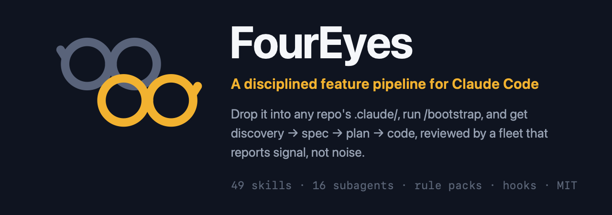

[English](README.md) · **Русский**

# FourEyes 🤓

> Самодостаточный `.claude/`, который превращает любой репозиторий в дисциплинированную фабрику фич — один адаптивный конвейер от discovery до отгруженного кода, за которым стоит флот субагентов, возвращающих сигнал, а не шум.

*Оба смысла заложены намеренно. **Four-eyes** — это тот самый очкарик, который и правда прочитал инструкцию. **Принцип четырёх глаз** (four-eyes principle) — правило, по которому ни одна значимая работа не принимается на одной паре глаз. Кит автоматизирует второе, чтобы вы могли позволить себе быть первым.*

Положите его в `.claude/` проекта, запустите `/bootstrap` — и получите адаптирующийся к стеку конвейер фич (`/discover → /analyst → /prepare → /implement`), 49 навыков, 16 субагентов, always-on-правила и хуки, подогнанные под *ваш* репозиторий, без переписывания навыков под каждый проект.

## Быстрый старт

**1. Скопируйте кит в проект.** Замените `<project>` на путь к вашему проекту и запускайте откуда угодно, **кроме** самого проекта: клон — временные леса, а не то, что вы оставляете себе.

```bash
# 1. Склонируйте кит во временное место — НЕ внутрь проекта
git clone https://github.com/mik2win/foureyes.git /tmp/foureyes

# 2. Забэкапьте всё, что кит и /bootstrap могут перезаписать
[ -e <project>/.claude ]   && cp -r <project>/.claude <project>/.claude.bak
[ -f <project>/CLAUDE.md ] && cp <project>/CLAUDE.md <project>/CLAUDE.md.bak

# 3. Скопируйте кит в .claude/ проекта (инфраструктура репозитория остаётся снаружи)
rsync -a --exclude='.git' --exclude='.claude' --exclude='_backlog' --exclude='tools' \
  --exclude='guide' --exclude='.github' --exclude='LICENSE' --exclude='CONTRIBUTING.md' \
  --exclude='CHANGELOG.md' --exclude='CODE_OF_CONDUCT.md' --exclude='SECURITY.md' \
  --exclude='.gitignore' \
  /tmp/foureyes/ <project>/.claude/

# 4. Удалите клон — кит теперь живёт в вашем проекте
rm -rf /tmp/foureyes
```

**2. Откройте проект в Claude Code и запустите `/bootstrap`.** Он просканирует стек, составит черновик `.claude/PROJECT.md` (спросив про домен и всё неоднозначное), установит подходящие паки правил, подключит `CLAUDE.md` и `settings.json`, а в конце спросит **оставить или откатить**. Ничего не пишется без бэкапа, а отклонённый прогон не оставляет следов.

**3. Попробуйте.** Запустите `/analyst` и ответьте на несколько вопросов — или просто спросите `/which-skill "<что собираетесь делать>"`, и он направит.

Две вещи, которые стоит знать заранее: существующий `.claude/settings.local.json` **уцелеет** (копирование добавляет файлы, ваши оно не удаляет), а если под ваш стек пака правил в библиотеке нет — `/bootstrap` скажет об этом и предложит продолжить только с generic-правилами, он не угадывает. Полный разбор, обновление и удаление: [guide/ru/install.md](guide/ru/install.md).

## С чего начать?

| Что у вас в руках | Что набрать |
|---|---|
| новая фича, пока туманная | `/discover` → `/analyst` → `/prepare` → `/implement` |
| мелкое, понятное изменение | `/prepare` → `/implement`, затем `/code-review` |
| баг | `/diagnose`, затем `/tdd` или `/test`, чтобы закрепить фикс |
| незнакомая или унаследованная кодовая база | `/onboard` |
| результат, который вы не можете описать технически | `/idea` — спрашивает на простом языке и сам ведёт конвейер |
| целая поверхность на аудит («отревьюить каждый экран») | `/prompt-master` (проход программы) → карточки → `/prepare` по каждой |
| понятия не имею, какой из 49 подходит | `/which-skill "<ваша ситуация>"` |

```text
  ОСНОВНОЙ КОНВЕЙЕР
     /discover  →   /analyst   →   /prepare   →   /implement   →   /code-review + /test
     (ресерч)       (спека)        (план)          (сборка)          (проверка)
                       ▲              ▲                │
                    /grill         /grill      срез с тестами первыми → /tdd
                       └──── /domain-model: глоссарий CONTEXT.md + ADR (общий язык) ────┘

  ДО ТОГО КАК ВЛОЖИТЬСЯ  /spike (один риск) · /prototype (сравнить дизайны) · /select-tech
  ПАРАЛЛЕЛЬНЫЕ ВОЛНЫ     /prepare (декомпозиция) → N × /implement → /epic-status (след. волна?)
  ОТГРУЗКА               /close-epic → /preflight (тесты · deps · security · docs → GO/NO-GO)
  ОБУЧЕНИЕ               /retro — повторяющиеся уроки из отчётов об отклонениях → в ваши правила
```

Полная карта — все навыки, рекомендуемые цепочки и тот же поток в виде Mermaid-диаграммы — в [guide/ru/reference.md](guide/ru/reference.md).

## Что вы получаете

- **Конвейер, а не куча.** `discover → spec → plan → build → review` как единый самодвижущийся поток со stage gates, а не 200 агентов à la carte.
- **Субагенты, уважающие ваше контекстное окно.** Каждый finder соблюдает единый **Finding Contract** — ограниченные структурированные находки (`path:line` + severity + effort + конкретный вред) — поэтому review на 10 агентов возвращает сигнал, а не дамп на 8k токенов.
- **Drop-in и адаптация к стеку.** `/bootstrap` вычитывает ваш репозиторий в `PROJECT.md`; навыки остаются generic и подстраиваются в рантайме. Портирование = копия + bootstrap, никогда не правка навыков.
- **Переживает долгую работу.** План — единственный источник истины через компакцию и сессии, поэтому вы возобновляетесь посреди фичи без повторных объяснений.
- **Обучающийся цикл.** Каждый `/implement` пишет Deviation Report; `/retro` добывает из них повторяющиеся паттерны и вплавляет уроки обратно в ваши правила.
- **Агент никогда не публикует код без вас.** `git add`/`commit`/`merge`/`push` запрещены в `settings.json` и жёстко блокируются хуком — он выводит команду, вы её запускаете.

Навыки по умолчанию **ручные**: 41 из 49 несут `disable-model-invocation: true` и запускаются, только когда *вы* их набираете. Это осознанно, у этого есть измеренная цена, и есть три обходных пути — [весь размен, с цифрами](guide/ru/evidence.md#manual-skills).

## Честно о том, что проверено

Кит прогнали через слепой A/B-стенд до публикации: два арма одного и того же реального репозитория, запечатанная карта перемешивания, рубрика по 5 осям, четыре раунда, ~40 отсуженных сессий. Результаты, которые говорят *против* кита, опубликованы наравне с остальными: always-on-тир правил не дал **измеримого прироста качества** за три раунда (он всего лишь дешевле) — именно поэтому его урезали с 13 правил до 4. Один Python-репозиторий, n=2 на ячейку, судья — модель: это направление, а не бенчмарк. Stack-паки (ruby / rails / react-ts / postgres) вообще не участвовали ни в одном арме.

Полная таблица, включая негативные результаты → [guide/ru/evidence.md](guide/ru/evidence.md).

## Дальше

| | |
|---|---|
| [guide/ru/reference.md](guide/ru/reference.md) | Все навыки, агенты, правила, хуки и раскладка репозитория · рекомендуемые потоки · принципы дизайна |
| [guide/ru/install.md](guide/ru/install.md) | Полный разбор установки · `/update-kit` (3-way merge) · `/teardown` |
| [guide/ru/evidence.md](guide/ru/evidence.md) | Что измерил A/B-стенд, включая результаты против кита |
| [guide/ru/why.md](guide/ru/why.md) | Слой дисциплины · чем отличается от каталогов и методологий · почему копирование внутрь, а не плагин |
| [docs/](docs/) | Справочный материал, который читает сам кит (на английском): 22 режима отказа агентов, генерация изнутри, decision craft, паттерны промптов |

Английские версии всех четырёх — в [guide/en/](guide/en/).

**Родословная.** FourEyes стоит на идеях, популяризованных [навыками Matt Pocock](https://github.com/mattpocock/skills) и [obra/superpowers](https://github.com/obra/superpowers) — интервью по одному вопросу, живой ubiquitous language + ADR, дизайн глубоких модулей, методология discover→ship. Добавляет он дисциплинированный мульти-агентный слой и портируемую, адаптирующуюся к стеку дистрибуцию. Заимствован метод, а не текст; оба апстрима под MIT, как и FourEyes ([LICENSE](LICENSE)). Подробнее: [guide/ru/why.md](guide/ru/why.md).

Контрибьюции приветствуются — начните с [CONTRIBUTING.md](CONTRIBUTING.md). Паки правил — наименее проверенная часть кита и самое полезное, что можно починить.
