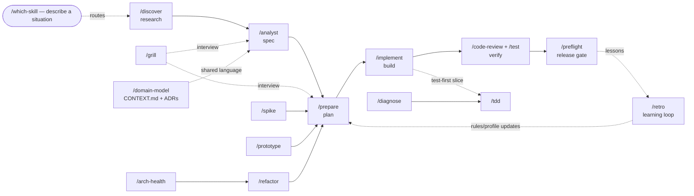

[← README](../../README.md) · **English** · [Русский](../ru/reference.md)

# FourEyes reference — every skill, agent, rule, and hook

## What's in it

| Part | What |
|------|------|
| **Pipeline skills** | `/discover` → `/analyst` → `/prepare` → `/implement` (research → spec → plan → code — `/implement` routes every finding it hits down one of four branches: fix it, file it, STOP and ask, or hand it to the sibling that owns the file) · `/idea` — the plain-language front door over the whole spine: a non-technical user describes an outcome, the agent elicits the wish in outcome scenarios, shows 2–3 solution shapes with felt trade-offs, then drives the pipeline itself, owning every technical decision (register contract: `docs/audience-altitude.md`) · `/scaffold` — the short branch off the spine for "add another one like the existing one": read the canonical exemplar first, place it per the profile, then wire every registration point and **prove each one with a command** (the failure this task really has is silent — an unexecuted load-bearing import raises nothing, the artifact is just missing from `--help`) |
| **Orientation** | `/onboard` — fast comprehension of an unfamiliar/inherited codebase: run-it-first (behavior anchors reading), one flow traced end-to-end (the architecture's dialect), git-history archaeology (churn hotspots = where the business lives, bus factor, the feared-old code), tests-as-documentation, a load-bearing-weirdness list (surprising code is never normalized on first contact) → a written orientation map that feeds `/bootstrap` |
| **Explore-first** | `/spike` (validate ONE risky hypothesis, time-boxed, throwaway) · `/prototype` (explore a design space — runnable logic or several UI variations) · `/select-tech` (choose a library/gem/framework/service or decide to build: hard filters kill fast, then an adversarial deep-dive on 2–3 finalists — the issue tracker over the README, a hard-case probe against real docs instead of the tutorial case, upgrade-path history as your future tax, bus factor, escape cost — scored matrix with ONE recommendation, the "build it ourselves" zero option always on the ballot, and an adapter-seam integration contract so the choice stays a two-way door; all candidate facts verified live, never from memory) |
| **Alignment & design** | `/grill` (relentless one-question interview primitive the pipeline reuses) · `/grill-with-docs` (grill + capture terms/ADRs inline) · `/domain-model` (living `CONTEXT.md` glossary + ADRs — the project's shared language) · `/codebase-design` (deep-module design vocabulary) · `/api-design` (public contracts — endpoint/webhook/CLI/library: consumers & compatibility promise first, resource model in the domain language, the contract checklist — one error envelope, cursor pagination on every list from day one, idempotency keys for retried non-GETs, additive-only evolution — worked examples including the error cases, and a consumer's-eyes pass that writes the client code for the hard case before the contract ships; Hyrum's law taken seriously: every exposed field is forever) |
| **Quality skills** | `/code-review` (CRITICAL findings pass an adversarial `finding-verifier` gate before you see them), `/refactor`, `/diagnose`, `/test`, `/tdd` (red-green-refactor, test-first), `/test-spec` (spec-first — derive tests from a plan *without reading the code*; the spec is truth), `/arch-health` (periodic ball-of-mud scan + PROJECT.md drift check) · `/clean-mvp` (whole-codebase cruft sweep — dead code, unused files, legacy shims, with a proof-of-deadness gate) · `/sweep` (mass mechanical migration: full site inventory → pilot batch → verified batches → zero-leftover re-scan; at ~30+ mechanical sites it writes the tool, not the edits — an AST-based codemod proven on the pilot and kept as a re-runnable artifact, because hand-editing a long tail is a compounding error surface) · `/perf` (measurement-first optimization: named metric + budget before any code is read, reproducible baseline, the profile picks the target — never intuition, biggest-lever order (don't do the work > batch it > right algorithm > micro), one change per re-measure with expected-vs-actual, caches declared with invalidation + ceiling, stop at the budget — over-optimization is negative-value work) · `/audit-quality` (scoped SOUND / SHORTCUT / HACK audit of a module or changeset, judged against *this* codebase's own architecture — read-only, each verdict carries the architecturally correct alternative, fix effort, and blocking status, and it hands back a phased refactor plan; the `quality-auditor` agent preloads it as its rubric) |
| **Architecture evolution** | `/decompose` (monolith vs modular monolith vs service extraction, decided per boundary on evidence — real drivers (deploy contention, asymmetric scaling, failure isolation, team ownership — org facts *asked*, never inferred from code) weighed against the explicitly-accepted distributed tax; verdict STAY / MODULARIZE / EXTRACT with "extract the seam before the service" as the governing rule, STAY recorded as a first-class ADR so it isn't relitigated; EXTRACT executes via `/rollout`'s strangler stages) · `/revisit` (decisions rot silently — re-audit past choices (ADRs, `/select-tech` picks, undocumented load-bearing choices via git archaeology) by extracting each decision's falsifiable assumptions and testing them against today: internal evidence from the repo, external evidence verified live (never from memory), org changes asked; verdict HOLDS / STRAINED (measurable tripwire set) / BROKEN (reopened only on a named broken assumption with evidence — an assumption audit, not a preference audit); supersede ADRs, never rewrite) · `/distill` (mine the repo's implicit conventions along ten dimensions with ≥3 cited occurrences each; verdict BLESS / UNIFY (fork tax — winner picked with the user, loser's sites → `/sweep`) / BAN (replacement always named) / DEEPEN (copy-paste family → deep module); intent gate before any ban — weird-but-consistent beats familiar-but-foreign; verdicts installed at the right altitude: lean always-on rules with in-repo GOOD/BAD exemplars, heavy reference on-demand, terms → `CONTEXT.md`) — the review-what's-built triad: structure (`/decompose`), decisions (`/revisit`), conventions (`/distill`) |
| **Ship & learn** | `/rollout` (staged strategy for risky/irreversible changes — expand-contract, strangler fig, flags/canary, versioned coexistence; every stage deployable, verifiable, and reversible alone; the destructive step last, gated on observed zero-dependence) · `/preflight` (release-readiness gate: full suite, deps/security quick pass, docs drift, config/migration check, changelog draft, GO/NO-GO verdict — deploy suggested, never run) · `/incident` (production fire discipline — the live inversion of `/diagnose`: triage → preserve evidence *before* mitigation destroys it → mitigate toward known-good (rollback/flag-off, no novel code under adrenaline) → verify recovery by user-visible signal → blameless review; commands suggested, never run) · `/deploy` (*which* deploy command this change actually needs — classify the working tree against the profile's Deploy mapping, name the cheapest sufficient command and what it costs, including the "no deploy needed" branch and a post-deploy verification checklist; handed over as text, never executed) · `/retro` (the learning loop: mine Deviation Reports, handoffs, and diagnose logs for recurring, verified patterns and fold each lesson back into rules/PROJECT.md/skills with confirmation) |
| **Backlog (local tracker)** | `/to-prd` (conversation → PRD) · `/to-issues` (plan → vertical-slice issues) · `/triage` (move issues through the state machine) · `/epic-status` (read-only progress dashboard over a wave-structured decomposition: next safe wave, session-collision check, and the epic's `RUN-ORDER` read against the plans' own frontmatter — a `∥` mark is a *claim*, re-verified against the `Owns` sets, and drift between the two is reported, never silently reconciled) · `/close-epic` (its terminal counterpart — every plan terminal, then an **end-to-end battery**: the epic's declared `## E2E verify` block if it has one, otherwise a battery *derived* from the surfaces the diff touched and disclosed as derived; drives are delegated but the verdict is not, and one headline number is always re-derived by hand; then plan↔code conformance + docs-drift, a completeness critic, **promotion of every flagged follow-up into a numbered card** (`F<wave>.<n>`, with where it goes and why), a predicted-vs-actual ledger row, `## E2E results` written back into the epic overview, and a copy-paste archive command it never runs) — all local markdown, no external tracker |
| **Session / context** | `/handoff` — snapshot live state (done · next · decisions · files · how to verify) into a resume doc; the `precompact.sh` hook re-injects a preservation checklist on every context compaction |
| **Meta** | `/which-skill` (router — "which skill fits my situation") · `/prompt-master` (compile an idea into a phased pack of self-contained prompts to run in other sessions/models — wraps the kit pipeline or embeds the full methodology standalone; also authors the **tier-1 program pass**: a whole-surface discovery sweep whose emitted agent prompts carry the evidence-file convention and whose output contract is report + evidence + cards + RUN-ORDER, stopping before implementation. A deterministic pack is *also* emitted as a `Workflow` script — emitted, never run: invoking one is the user's opt-in, not a skill's) · `/writing-skills` (kit-internal authoring reference) |
| **Security** | `/threat-model` (design-time STRIDE-lite BEFORE code exists — entry points × trust boundaries × data classes, the two actors every spec forgets (the unauthenticated stranger, the authenticated-wrong-tenant user), abuse cases: hostile power user / curious insider / forged webhooks; every threat lands as a falsifiable AC, a plan step, or a user-signed accepted risk — never advice) · `/audit-security` (orchestrating OWASP-style sweep over EXISTING code → risk-tiered report + deploy verdict) · `/deps` (dependency-vulnerability audit) · the `security-reviewer` agent (delegates to the built-in `/security-review`), the `guard-secrets` warn-only hook, and always-on `rules/_generic/code.md` |
| **Code-publish control** | The agent **never publishes code without you**: `git add`/`commit`/`merge`/`push` are denied in `settings.json` and hard-blocked by `guard-bash.sh` (suggest-only — it outputs the command, you run it). `/bootstrap` surveys the policy and lets you forbid more commands. Web search/fetch for research stay available — this governs *code leaving the machine*, not reading the web. Complementary built-in safety layers: **`/rewind` checkpoints** (undo the agent's edits per-step) and Claude Code's **`sandbox` settings** (OS-level isolation for risky runs) — use them alongside the kit's guards, not instead |
| **Adapter** | `/bootstrap` — detect stack, write profile, install & reconcile rule packs (backs up first, confirms keep/rollback at the end); `/update-kit` — pull a newer kit version into an already-bootstrapped project (3-way merge, keeps your adaptations); `/teardown` — clean up leftovers or uninstall & restore |
| **Agents** | Review & verify: `code-reviewer`, `parallel-reviewer` (modular fan-out), `security-reviewer`, `finding-verifier` (adversarial 3-lens check of findings before they become plans; panel mode for CRITICALs — 3 instances, one lens each, majority vote), `plan-verifier` (implemented plan vs git history), `quality-auditor` (SOUND/SHORTCUT/HACK post-implementation), `completeness-critic` (final-pass "what's missing" hunter over reports/specs/close-outs), `plan-challenger` (adversarial PRE-implementation review — the implementation session that hasn't happened yet: opens every file the plan touches and checks the plan's model of it, demands quoted interfaces, walks case coverage, greps ripples past the impact map, audits assumption ownership; fresh-context on purpose so it has the plan but not the planner's rationalizations; /prepare's Complex-tier gate) `idea-skeptic` (the same adversarial move one stage earlier — it attacks an *idea*, proposal, or backlog card on four lenses (economics at this project's real scale, supply/starvation, claim honesty, measurability) before `/idea` or `/discover` queues it, where `plan-challenger` attacks a plan) · Analysis: `deep-analyzer`, `arch-tracer`, `test-gap-finder`, `performance-analyzer` (hot paths, complexity, memory, I/O & N+1, concurrency) · Writers: `docs-writer`, `test-writer` (parallel, worktree-isolated) · Research: `backlog-researcher` (feasibility pass on a backlog item). All read `PROJECT.md` at start and degrade gracefully pre-`/bootstrap`; per-agent `model:`/`effort:` frontmatter matches depth to the job (verifiers high, mechanical writers medium); finders share one anti-noise Finding Contract (`path:line` + severity + effort + concrete harm scenario), also shipped as a JSON Schema (`schemas/finding.schema.json`) for structured fan-out output |
| **Generic rules** | `rules/_generic/` — language-neutral, in **three load tiers** (visible in `/context`): **always-on** is a single file, [`core.md`](../../rules/_generic/core.md) (~950 tokens, no `paths:`) — Evidence, Done, Decisions, Reporting: the judgment that must be present in the first reasoning turn. It is the distillate of what were once five separate always-on rules; the 13→4 tier cut collapsed them after an A/B round measured **no behavioural delta and +13% cost** for the extra tier. Next, **`paths: "**/*"`-scoped** rules load on first file read — `code.md` (comments, greppability, boundary validation, security), `code-quality.md`, `exception-patterns.md`, `testing.md`, `observability.md`, `external-api-integration.md`, `resilience.md` (timeouts/retry/circuit-breaker/idempotency), `service-layer.md` (thin shells + CQS), `domain-events.md`. Last, a **narrow on-demand tier** scoped to where each fires — `delegation.md` (`.claude/agents,skills` — subagent briefs, reports-are-claims, honest aggregation, vary-the-lens fan-out, the tools a subagent will not get, an empty return is a failed unit), `memory.md` (`.claude/agents` — one fact per file, indexed, update-don't-duplicate), `sql.md` (SQL / migration / model / repository / query paths — engine-independent rules for index ownership, reading a plan, keyset pagination, read-check-then-write races and natural keys; the stack pack carries the engine), and the plan/spec pair `planning-artifacts.md` + `parallel-wave-execution.md` (the Artifact-Continuity Contract and stage gates; the in-flight wave contract — disjoint `Owns`, serialization points, the out-of-`Owns` classification table) |
| **Stack rule packs** | `_kit/rules-library/` — `python`, `react-ts`, `ruby`, `rails`, `postgres`; each bundles lean always-on rules + optional on-demand reference skills (e.g. `/ruby-idioms`, `/rails-reference`, `/postgres-reference`) |
| **Hooks** | `hooks/` — guard-bash (reconciled with 2026 built-in destructive-command protection — no double prompts; keeps the kit's publish policy), guard-secrets (warn-only), format-file, sessionstart, precompact (context-preservation on compaction), subagent-stop (warn-only Finding Contract gate on subagent reports), verify-stop (opt-in, OFF-by-default, non-blocking lint/test gate), skill-hint (opt-in, OFF-by-default, advisory prompt→skill hint — see [Skills are manual by default](evidence.md#skills-are-manual-by-default--and-the-three-escape-hatches)) |
| **Contracts** | `PROJECT.template.md`, `settings.template.json`, `CLAUDE.snippet.md`, `schemas/finding.schema.json` (the Finding Contract as JSON Schema — pass it to fan-out finders for mechanically mergeable output) |
| **Docs** | `docs/observability.md` (product observability — the wide-event attribute catalogue, span shaping, event-based SLIs, LLM-feature signals) · **the legacy quintet**: `docs/agent-failure-modes.md` (22 systematic agent failure modes with mechanisms & countermeasures — `/retro` classifies against it, `/writing-skills` designs against it) · `docs/self-knowledge.md` (generation from the inside — thirteen phenomena only visible from within the model, each with mechanism, detection, and technique. Part I, truth: confabulation tells & the neighborhood test, the snapshot problem, self-anchoring, author blindness, regression to the training mean, correlated blind spots, lens activation, the entropy budget, the correction gradient. Part II, the physics of effort — why "laziness" is allocation, not motivation, and why threats produce anxious text instead of work: the aesthetic stop, difficulty inversion, minimal-diff bias, homework return. Distilled into always-on `rules/_generic/core.md`) · `docs/working-with-agents.md` (the developer's side: briefing, steering, verifying, feeding the learning loop; + the worktree-inheritance limitation and its re-check test) · `docs/prompt-patterns.md` (design prompts/skills for the weakest model that will run them — 12 degradation-proof construction patterns) · `docs/decision-craft.md` (judgment under uncertainty — the layer above execution: doors/reversibility pricing, the cheapest killing probe, predict-before-you-peek, calibration & reference-class estimation, the pre-mortem as prospective hindsight, when *not* to decompose, invariants as review lens and property-test seed. Distilled into always-on `rules/_generic/core.md`) · `docs/audience-altitude.md` (the conversation register per `PROJECT.md` → Audience — what a non-technical user is asked and what is decided for them; `/idea`'s contract) · `docs/agent-teams.md` (experimental agent-teams → kit-waves mapping — document, don't depend) |

## Using the kit — recommended flows

The skills are **composable**: reach for one directly, or chain them. Unsure which fits? Ask **`/which-skill "<your situation>"`** — it routes any situation to the right skill or chain.

### Three tiers — pick the right entry point

Work arrives at three sizes, and each has its own entry point. Sending a whole surface to `/prepare` is the common mistake this table exists to prevent.

| Tier | What you're holding | Entry point | What comes out |
|------|---------------------|-------------|----------------|
| **1 · Program** | a whole *surface* to audit or map — the output is plausibly 10+ separate pieces of work ("review every screen", "audit this whole area") | `/prompt-master` (program pass) | `00-report.md` (ranked findings) + `evidence/` (one file per agent) + `cards/NN-<slug>.md` + `RUN-ORDER.md` |
| **2 · Epic** | one card, or one coherent change | `/prepare` | `00-overview.md` + `NN-<subtask>.md` decomposed into file-disjoint waves |
| **3 · Session** | one prepared subtask | `/implement` | code + implementation log + deviation report |

A tier-1 pass **stops at cards** — it never writes plans and never implements; each card is then one `/prepare` input. Tier 2's wave machinery is what makes tier 3 sessions safe to run in parallel; `/epic-status` reports on it and `/close-epic` settles it.

```text
  ask  /which-skill "<situation>"   →   it routes you to a step or the whole chain below
  ─────────────────────────────────────────────────────────────────────────────────────

  MAIN PIPELINE
     /discover  →   /analyst   →   /prepare   →   /implement   →   /code-review + /test
     (research)     (spec)         (plan)          (build)           (verify)
  NON-TECHNICAL?    /idea — "I want it so that…" → the agent drives this whole pipeline
                    itself: plain-language questions, felt trade-offs, behavior-first delivery
                       ▲              ▲                │
                    /grill         /grill      test-first slice → /tdd
                       └──── /domain-model: CONTEXT.md glossary + ADRs (shared language) ────┘
       across all stages:  /codebase-design — deep-module vocabulary (prepare · tdd · refactor)

  BEFORE COMMITTING      /spike (one yes/no risk)   ·   /prototype (compare designs)
  FIX A BUG              /diagnose  →  /tdd | /test  (lock with a regression test)
  REFACTOR               changed code: /code-review  →  /refactor
  ARCHITECTURE HEALTH    /arch-health  →  /refactor (small) | /prepare → /implement (large)
  CODEBASE SWEEP         /clean-mvp (dead code & cruft, whole tree, proof-of-deadness first)
  PARALLEL WAVES         /prepare (decompose)  →  N × /implement  →  /epic-status (next wave?)
  REQUIREMENTS→BACKLOG   /grill-with-docs → /analyst → /to-prd → /to-issues → /triage
  MASS MIGRATION         /sweep (inventory → pilot → verified batches → zero-leftover re-scan)
  SHIP                   /close-epic → /preflight (suite·deps·security·docs·changelog → GO/NO-GO)
  LEARN                  /retro (recurring lessons from deviation reports → back into rules/profile)
  MAINTAIN               /deps  ·  /handoff  ·  /writing-skills (author a kit skill)
```

<details>
<summary>Same map as a Mermaid diagram (renders on GitHub)</summary>



</details>

Common flows by activity:

### Build a feature (the main pipeline)
`/discover` (prior art & reuse) → `/analyst` (spec via interview) → `/prepare` (design, impact, decomposition) → `/implement` (build + architecture audit + tests, plus a behavior check that drives *this* slice and names the epic's outstanding rows by number) → `/code-review` + `/test`. Run `/domain-model` alongside to capture terms/decisions into `CONTEXT.md` as they surface.
- **Small, known change?** Skip ahead — `/prepare` then `/implement` (or `/implement` directly); finish with `/code-review`.
- **Still fuzzy?** Start at `/discover`, or `/grill-with-docs` to align *and* build the shared language in one session.

### Plan & analytics (requirements → work items)
`/grill` or `/grill-with-docs` (pressure-test the idea, one question at a time) → `/analyst` (WHAT/WHY spec) → `/to-prd` (write up the discussion) → `/to-issues` (break into vertical-slice issues) → `/triage` (sort the local backlog, pick what's next). `/domain-model` keeps the ubiquitous language (`CONTEXT.md` + ADRs) sharp throughout. For a wave-structured epic from `/prepare`, `/epic-status` reports progress, the next safe wave, and session collisions.

### Test
- **New code, test-first:** `/tdd` — red → green → refactor in vertical slices (`/implement` can delegate a slice to it).
- **Cover or clean existing tests:** `/test` — gap analysis, AAA/mocking discipline, refactor.
- **Lock a bug fix:** reproduce with a failing test first (see *Debug*).

### Debug
`/diagnose` (reproduce → isolate → root-cause → fix → verify) → `/tdd` or `/test` to lock the fix with a regression test.

### Refactor & architecture health
- **Clean changed code (same behaviour):** `/code-review` (find) → `/refactor` (apply + format + test).
- **Whole-codebase health, every few days:** `/arch-health` (rank shallow-module / ball-of-mud opportunities) → `/refactor` (small) or `/prepare` → `/implement` (large). `/codebase-design` is the shared deep-module vocabulary both lean on.
- **Sweep the cruft (MVP stage):** `/clean-mvp` — whole-tree dead-code/legacy-shim removal with a proof-of-deadness evidence gate and batched confirmations before anything is deleted.

### Explore / de-risk before committing
- **One yes/no risk:** `/spike` (throwaway, time-boxed). **A design space (logic or UI options):** `/prototype` (several variations to compare).

### Maintain
- **Dependencies & vulnerabilities:** `/deps` + the `security-reviewer` agent.
- **Pausing / handing off:** `/handoff` (snapshot state into a resume doc).
- **Adding a kit skill:** `/writing-skills` (authoring reference).

## Design principle

Skills carry **only invariant workflow logic**. Every project fact (stack, commands, paths, layers, domain, integrations) lives in one place — **`.claude/PROJECT.md`** — which skills read at runtime. So porting = copy the kit + run `/bootstrap`, not editing skills.

A second, **living** document is the project's **`CONTEXT.md`** — the ubiquitous-language glossary (plus ADRs in `docs/adr/`) that `/domain-model` builds as you work. `PROJECT.md` holds static facts; `CONTEXT.md` holds the shared vocabulary, so the agent stays terse and names code consistently. Skills read it when present and speak its language.

**Artifact-Continuity Contract.** Because a fresh session reads only the plan file — not the chat — `rules/_generic/planning-artifacts.md` (on-demand, scoped to plan/spec/backlog files and read by every planning skill on entry) makes the planning artifact the single source of truth: every plan-touching skill and agent persists decisions (including test scope) into the affected plan the turn they're made, cross-links each spike/review/grill report from the plan header, sweeps sibling plans + the epic overview after a decision ripples, and marks load-bearing framework behaviour as an assumption to validate via `/spike`. It's the "Finding Contract" idea applied to plans, so context stops leaking between stages and sessions.

**Artifact git policy.** The agent's working artifacts (briefs, specs, plans, PRDs, issues, handoff notes) and the shared model (`CONTEXT.md` + ADRs) each have a git policy you choose **interactively at `/bootstrap`** — keep a category **local** (gitignored, never pushed) or **commit** it (shared). The default offers working backlog as local scratch and `CONTEXT.md`/ADRs as committed shared knowledge, but you decide per category; `/bootstrap` writes the choice to `PROJECT.md` and adds the local paths to `.gitignore`. The agent never commits anything itself.

## Rule packs

> **Maturity, honestly.** The packs are the least-proven part of the kit. Their *shape* — the path-scoped rule / on-demand reference split below — comes straight from what the bench measured about always-on context. Their *content* does not: only the generic rules were ever in an arm, and every pack here was written for a project, not validated by a run. Use them as a starting skeleton for your stack, expect to rewrite half, and PRs correcting them are the single most useful contribution to this repo.

Stack rules live in `_kit/rules-library/<stack>/` — edit them there. Each pack has a `pack.yaml` (`detect` / `installs` / `assumptions`); the format is in `_kit/rules-library/PACKS.md`. Kit manifest / internals: `_kit/KIT.md`.

Each pack ships two layers (the `rule` vs `skill` triage is spelled out in `PACKS.md`):
- **Path-scoped rules** (`claude/rules/*.md`) — lean, imperative conventions scoped to the tightest `paths:` for the layer they govern; they load in full whenever a matching file is read. (Kit judgment rules omit `paths:` on purpose so they load at launch — see the Generic-rules row.)
- **On-demand reference skills** (`claude/skills/*-reference/`) — worked GOOD/BAD examples, API tours, and checklists that load only when invoked, so always-on context stays lean. The `ruby` / `rails` / `postgres` packs split their heavy convention rules this way (e.g. `/ruby-idioms`, `/rails-reference`, `/postgres-reference`).

## Layout

```
foureyes/                     → its contents become <project>/.claude/
├── skills/{bootstrap,update-kit,teardown,idea,discover,analyst,prepare,spike,prototype,select-tech,implement,scaffold,code-review,audit-quality,refactor,diagnose,test,test-spec,tdd,arch-health,decompose,revisit,distill,clean-mvp,sweep,audit-security,deps,handoff}/
│         {grill,grill-with-docs,domain-model,codebase-design,api-design,threat-model,onboard,perf,to-prd,to-issues,triage,epic-status,close-epic,rollout,deploy,preflight,incident,retro,which-skill,prompt-master,writing-skills}/
├── agents/*.md             # 16 subagents (review/verify incl. finding-verifier + completeness-critic + plan-challenger, analysis, writers, research)
├── rules/_generic/*.md     # core.md is the ONLY always-on rule — evidence, done-is-external, decision pricing, honest reporting, merged from five earlier files by the 2026-08 tier cut (the bench found the tier bought cost, not quality); code rules paths:-scoped to **/* (code, code-quality, testing, resilience, service-layer, domain-events, observability, …); narrow on-demand (delegation, memory, planning-artifacts, parallel-wave-execution) scoped to where each fires
├── hooks/*.sh              # guard-bash, guard-secrets, format-file, sessionstart, precompact, subagent-stop, verify-stop, skill-hint (last two opt-in, unwired by default — see settings.*.example.json)
├── output-styles/review.md
├── schemas/finding.schema.json   # the Finding Contract as JSON Schema (structured fan-out output)
├── docs/{observability,agent-failure-modes,self-knowledge,decision-craft,working-with-agents,prompt-patterns,audience-altitude,agent-teams}.md
├── PROJECT.template.md  settings.template.json  CLAUDE.snippet.md
├── settings.stop-gate.example.json  settings.skill-hint.example.json   # opt-in hook blocks to merge by hand
├── _kit/                    # build-time only — /bootstrap removes it after adapting
│   ├── KIT.md
│   ├── rules-library/{python,react-ts,ruby,rails,postgres}/ + PACKS.md
│   └── templates/commands/{commit,pr,mr}.md
├── assets/{logo.svg,banner.svg,banner.png,social-preview.svg,social-preview.png}
│                          # icon · README banner (1280x450) · GitHub social preview (1280x640)
├── guide/{en,ru}/{reference,install,evidence,why}.md   # this documentation, NOT copied in
├── tools/validate-kit.py   # repo infrastructure, NOT copied in — frontmatter, listing budget,
├── .github/                #   dead links (markdown + backticked kit paths), hooks, JSON
│   ├── workflows/ci.yml
│   └── ISSUE_TEMPLATE/
├── CONTRIBUTING.md  CHANGELOG.md  CODE_OF_CONDUCT.md  SECURITY.md
└── LICENSE                 # MIT
```

Everything from `guide/` down is documentation and repo infrastructure, excluded from the copy-in: `guide/` is the README's long form (it explains the kit, it doesn't run in your project), and `tools/validate-kit.py` validates the kit rather than being part of it. Run the validator before opening a PR:

```bash
python3 tools/validate-kit.py --stats
```
